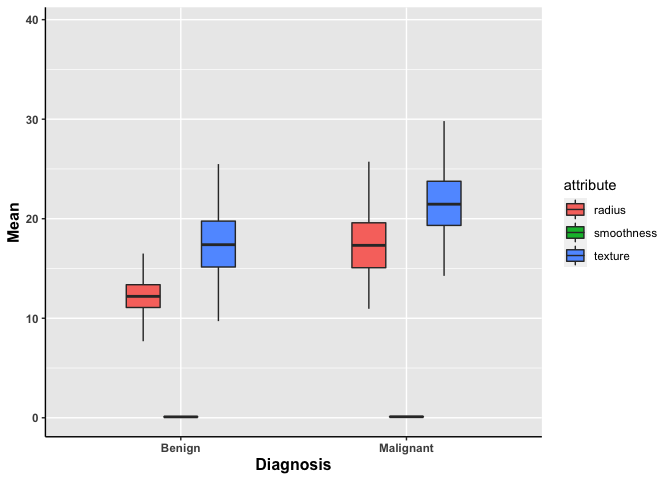
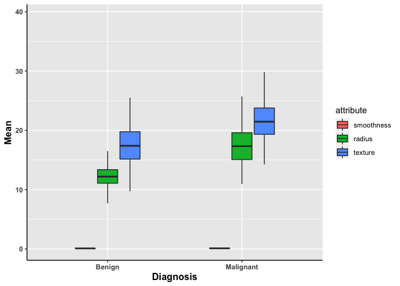
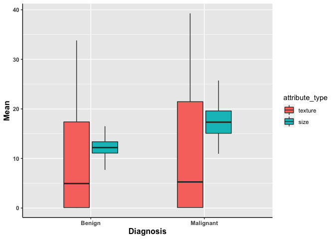

Mini Data Analysis Milestone 2
================

*To complete this milestone, you can edit [this `.rmd`
file](https://raw.githubusercontent.com/UBC-STAT/stat545.stat.ubc.ca/master/content/mini-project/mini-project-2.Rmd)
directly. Fill in the sections that are commented out with
`<!--- start your work here--->`. When you are done, make sure to knit
to an `.md` file by changing the output in the YAML header to
`github_document`, before submitting a tagged release on canvas.*

# Welcome to your second (and last) milestone in your mini data analysis project!

In Milestone 1, you explored your data, came up with research questions,
and obtained some results by making summary tables and graphs. This
time, we will first explore more in depth the concept of *tidy data.*
Then, you’ll be sharpening some of the results you obtained from your
previous milestone by:

-   Manipulating special data types in R: factors and/or dates and
    times.
-   Fitting a model object to your data, and extract a result.
-   Reading and writing data as separate files.

**NOTE**: The main purpose of the mini data analysis is to integrate
what you learn in class in an analysis. Although each milestone provides
a framework for you to conduct your analysis, it’s possible that you
might find the instructions too rigid for your data set. If this is the
case, you may deviate from the instructions – just make sure you’re
demonstrating a wide range of tools and techniques taught in this class.

# Instructions

**To complete this milestone**, edit [this very `.Rmd`
file](https://raw.githubusercontent.com/UBC-STAT/stat545.stat.ubc.ca/master/content/mini-project/mini-project-2.Rmd)
directly. Fill in the sections that are tagged with
`<!--- start your work here--->`.

**To submit this milestone**, make sure to knit this `.Rmd` file to an
`.md` file by changing the YAML output settings from
`output: html_document` to `output: github_document`. Commit and push
all of your work to your mini-analysis GitHub repository, and tag a
release on GitHub. Then, submit a link to your tagged release on canvas.

**Points**: This milestone is worth 55 points (compared to the 45 points
of the Milestone 1): 45 for your analysis, and 10 for your entire
mini-analysis GitHub repository. Details follow.

**Research Questions**: In Milestone 1, you chose two research questions
to focus on. Wherever realistic, your work in this milestone should
relate to these research questions whenever we ask for justification
behind your work. In the case that some tasks in this milestone don’t
align well with one of your research questions, feel free to discuss
your results in the context of a different research question.

# Learning Objectives

By the end of this milestone, you should:

-   Understand what *tidy* data is, and how to create it using `tidyr`.
-   Generate a reproducible and clear report using R Markdown.
-   Manipulating special data types in R: factors and/or dates and
    times.
-   Fitting a model object to your data, and extract a result.
-   Reading and writing data as separate files.

# Setup

Begin by loading your data and the tidyverse package below:

``` r
library(datateachr) # <- might contain the data you picked!
library(tidyverse)
library(here)
```

# Task 1: Tidy your data (15 points)

In this task, we will do several exercises to reshape our data. The goal
here is to understand how to do this reshaping with the `tidyr` package.

A reminder of the definition of *tidy* data:

-   Each row is an **observation**
-   Each column is a **variable**
-   Each cell is a **value**

*Tidy’ing* data is sometimes necessary because it can simplify
computation. Other times it can be nice to organize data so that it can
be easier to understand when read manually.

### 2.1 (2.5 points)

Based on the definition above, can you identify if your data is tidy or
untidy? Go through all your columns, or if you have \>8 variables, just
pick 8, and explain whether the data is untidy or tidy.

<!--------------------------- Start your work below --------------------------->

``` r
head(cancer_sample)
```

    ## # A tibble: 6 × 32
    ##       ID diagn…¹ radiu…² textu…³ perim…⁴ area_…⁵ smoot…⁶ compa…⁷ conca…⁸ conca…⁹
    ##    <dbl> <chr>     <dbl>   <dbl>   <dbl>   <dbl>   <dbl>   <dbl>   <dbl>   <dbl>
    ## 1 8.42e5 M          18.0    10.4   123.    1001   0.118   0.278   0.300   0.147 
    ## 2 8.43e5 M          20.6    17.8   133.    1326   0.0847  0.0786  0.0869  0.0702
    ## 3 8.43e7 M          19.7    21.2   130     1203   0.110   0.160   0.197   0.128 
    ## 4 8.43e7 M          11.4    20.4    77.6    386.  0.142   0.284   0.241   0.105 
    ## 5 8.44e7 M          20.3    14.3   135.    1297   0.100   0.133   0.198   0.104 
    ## 6 8.44e5 M          12.4    15.7    82.6    477.  0.128   0.17    0.158   0.0809
    ## # … with 22 more variables: symmetry_mean <dbl>, fractal_dimension_mean <dbl>,
    ## #   radius_se <dbl>, texture_se <dbl>, perimeter_se <dbl>, area_se <dbl>,
    ## #   smoothness_se <dbl>, compactness_se <dbl>, concavity_se <dbl>,
    ## #   concave_points_se <dbl>, symmetry_se <dbl>, fractal_dimension_se <dbl>,
    ## #   radius_worst <dbl>, texture_worst <dbl>, perimeter_worst <dbl>,
    ## #   area_worst <dbl>, smoothness_worst <dbl>, compactness_worst <dbl>,
    ## #   concavity_worst <dbl>, concave_points_worst <dbl>, symmetry_worst <dbl>, …

*This dataset, is by the above standards, a tidy data set. Each
observation (ID) is a new row and each variable (diagnosis, radius_mean,
texture_mean etc.) all occupy their own column. Additionally, the
variable names are an acceptable format that doesn’t present issues from
mistyping (capitals etc).*

<!----------------------------------------------------------------------------->

### 2.2 (5 points)

Now, if your data is tidy, untidy it! Then, tidy it back to it’s
original state.

If your data is untidy, then tidy it! Then, untidy it back to it’s
original state.

Be sure to explain your reasoning for this task. Show us the “before”
and “after”.

<!--------------------------- Start your work below --------------------------->

*This code chunk ‘untidies’ the dataset by widening the radius variable
and making each ID a new variable*

``` r
cancer_sample_untidy<- cancer_sample %>%
  pivot_wider(names_from = ID, values_from = radius_mean)
```

*This code chunk re-tidies the data but lengthening it and returning ID
and radius to single variable columns*

``` r
cancer_sample_tidy<- cancer_sample_untidy %>%
  pivot_longer(cols = !1:30, names_to = "ID", values_to = "radius_mean",
               values_drop_na = T) %>%
  relocate("ID", .before = diagnosis) %>%
  relocate("radius_mean", .after = diagnosis)
```

*This code chunk shows the before (untidy) and after (tidy)*

``` r
head(cancer_sample_untidy)
```

    ## # A tibble: 6 × 599
    ##   diagnosis texture_mean perim…¹ area_…² smoot…³ compa…⁴ conca…⁵ conca…⁶ symme…⁷
    ##   <chr>            <dbl>   <dbl>   <dbl>   <dbl>   <dbl>   <dbl>   <dbl>   <dbl>
    ## 1 M                 10.4   123.    1001   0.118   0.278   0.300   0.147    0.242
    ## 2 M                 17.8   133.    1326   0.0847  0.0786  0.0869  0.0702   0.181
    ## 3 M                 21.2   130     1203   0.110   0.160   0.197   0.128    0.207
    ## 4 M                 20.4    77.6    386.  0.142   0.284   0.241   0.105    0.260
    ## 5 M                 14.3   135.    1297   0.100   0.133   0.198   0.104    0.181
    ## 6 M                 15.7    82.6    477.  0.128   0.17    0.158   0.0809   0.209
    ## # … with 590 more variables: fractal_dimension_mean <dbl>, radius_se <dbl>,
    ## #   texture_se <dbl>, perimeter_se <dbl>, area_se <dbl>, smoothness_se <dbl>,
    ## #   compactness_se <dbl>, concavity_se <dbl>, concave_points_se <dbl>,
    ## #   symmetry_se <dbl>, fractal_dimension_se <dbl>, radius_worst <dbl>,
    ## #   texture_worst <dbl>, perimeter_worst <dbl>, area_worst <dbl>,
    ## #   smoothness_worst <dbl>, compactness_worst <dbl>, concavity_worst <dbl>,
    ## #   concave_points_worst <dbl>, symmetry_worst <dbl>, …

``` r
head(cancer_sample_tidy)
```

    ## # A tibble: 6 × 32
    ##   ID     diagn…¹ radiu…² textu…³ perim…⁴ area_…⁵ smoot…⁶ compa…⁷ conca…⁸ conca…⁹
    ##   <chr>  <chr>     <dbl>   <dbl>   <dbl>   <dbl>   <dbl>   <dbl>   <dbl>   <dbl>
    ## 1 842302 M          18.0    10.4   123.    1001   0.118   0.278   0.300   0.147 
    ## 2 842517 M          20.6    17.8   133.    1326   0.0847  0.0786  0.0869  0.0702
    ## 3 84300… M          19.7    21.2   130     1203   0.110   0.160   0.197   0.128 
    ## 4 84348… M          11.4    20.4    77.6    386.  0.142   0.284   0.241   0.105 
    ## 5 84358… M          20.3    14.3   135.    1297   0.100   0.133   0.198   0.104 
    ## 6 843786 M          12.4    15.7    82.6    477.  0.128   0.17    0.158   0.0809
    ## # … with 22 more variables: symmetry_mean <dbl>, fractal_dimension_mean <dbl>,
    ## #   radius_se <dbl>, texture_se <dbl>, perimeter_se <dbl>, area_se <dbl>,
    ## #   smoothness_se <dbl>, compactness_se <dbl>, concavity_se <dbl>,
    ## #   concave_points_se <dbl>, symmetry_se <dbl>, fractal_dimension_se <dbl>,
    ## #   radius_worst <dbl>, texture_worst <dbl>, perimeter_worst <dbl>,
    ## #   area_worst <dbl>, smoothness_worst <dbl>, compactness_worst <dbl>,
    ## #   concavity_worst <dbl>, concave_points_worst <dbl>, symmetry_worst <dbl>, …

<!----------------------------------------------------------------------------->

### 2.3 (7.5 points)

Now, you should be more familiar with your data, and also have made
progress in answering your research questions. Based on your interest,
and your analyses, pick 2 of the 4 research questions to continue your
analysis in the next four tasks:

<!-------------------------- Start your work below ---------------------------->

1.  Is radius, texture, or smoothness a better predictor of a malignant
    diagnosis?
2.  What is the relationship between cancer cell size (smoothness and
    radius) and diagnosis?

<!----------------------------------------------------------------------------->

Explain your decision for choosing the above two research questions.

<!--------------------------- Start your work below --------------------------->

*Honestly because they seemed like the most easy to work with. Both lend
themselves well to a glm() and plotting continuous variables against a
dichotomous dependent variable provides a good, understandable visual.*

<!----------------------------------------------------------------------------->

Now, try to choose a version of your data that you think will be
appropriate to answer these 2 questions. Use between 4 and 8 functions
that we’ve covered so far (i.e. by filtering, cleaning, tidy’ing,
dropping irrelevant columns, etc.).

<!--------------------------- Start your work below --------------------------->

``` r
#compact the data to only relevant variables 
cancer_compact<- cancer_sample %>%
  select(starts_with(c("ID", "diagnosis", "radius", "texture", "smoothness"))) %>%
  rename(radius=radius_mean, texture=texture_mean, smoothness=smoothness_mean) %>%
  mutate_if(is.character, as.factor) %>%
  arrange(diagnosis)
```

<!----------------------------------------------------------------------------->

# Task 2: Special Data Types (10)

For this exercise, you’ll be choosing two of the three tasks below –
both tasks that you choose are worth 5 points each.

But first, tasks 1 and 2 below ask you to modify a plot you made in a
previous milestone. The plot you choose should involve plotting across
at least three groups (whether by facetting, or using an aesthetic like
colour). Place this plot below (you’re allowed to modify the plot if
you’d like). If you don’t have such a plot, you’ll need to make one.
Place the code for your plot below.

<!-------------------------- Start your work below ---------------------------->

``` r
#this code creates a new dataframe with 3 groups to plot
vars_long<- cancer_compact %>%
  pivot_longer(cols = c("radius", "texture", "smoothness"), 
               names_to = "attribute", values_to = "average") %>%
  select(c("ID", "diagnosis", "attribute", "average"))
vars_long
```

    ## # A tibble: 1,707 × 4
    ##         ID diagnosis attribute  average
    ##      <dbl> <fct>     <chr>        <dbl>
    ##  1 8510426 B         radius     13.5   
    ##  2 8510426 B         texture    14.4   
    ##  3 8510426 B         smoothness  0.0978
    ##  4 8510653 B         radius     13.1   
    ##  5 8510653 B         texture    15.7   
    ##  6 8510653 B         smoothness  0.108 
    ##  7 8510824 B         radius      9.50  
    ##  8 8510824 B         texture    12.4   
    ##  9 8510824 B         smoothness  0.102 
    ## 10  854941 B         radius     13.0   
    ## # … with 1,697 more rows

``` r
#3-group plot
attribute_boxplot<- vars_long %>%
  ggplot(aes(x = diagnosis, y = average, fill = attribute)) +
  geom_boxplot(width=0.5, outlier.shape=NA) +
  labs(y = "Mean", x = "Diagnosis") + 
  scale_x_discrete(labels = c("Benign", "Malignant")) +
  theme(axis.title = element_text(size = 12, face = "bold")) +
  theme(axis.text = element_text(face = "bold")) +
  theme(axis.line = element_line(colour = "black", size = 0.5))
attribute_boxplot
```

<!-- -->

<!----------------------------------------------------------------------------->

Now, choose two of the following tasks.

1.  Produce a new plot that reorders a factor in your original plot,
    using the `forcats` package (3 points). Then, in a sentence or two,
    briefly explain why you chose this ordering (1 point here for
    demonstrating understanding of the reordering, and 1 point for
    demonstrating some justification for the reordering, which could be
    subtle or speculative.)

2.  Produce a new plot that groups some factor levels together into an
    “other” category (or something similar), using the `forcats` package
    (3 points). Then, in a sentence or two, briefly explain why you
    chose this grouping (1 point here for demonstrating understanding of
    the grouping, and 1 point for demonstrating some justification for
    the grouping, which could be subtle or speculative.)

3.  If your data has some sort of time-based column like a date (but
    something more granular than just a year):

    1.  Make a new column that uses a function from the `lubridate` or
        `tsibble` package to modify your original time-based column. (3
        points)

        -   Note that you might first have to *make* a time-based column
            using a function like `ymd()`, but this doesn’t count.
        -   Examples of something you might do here: extract the day of
            the year from a date, or extract the weekday, or let 24
            hours elapse on your dates.

    2.  Then, in a sentence or two, explain how your new column might be
        useful in exploring a research question. (1 point for
        demonstrating understanding of the function you used, and 1
        point for your justification, which could be subtle or
        speculative).

        -   For example, you could say something like “Investigating the
            day of the week might be insightful because penguins don’t
            work on weekends, and so may respond differently”.

<!-------------------------- Start your work below ---------------------------->

**Task Number**: 1

<!----------------------------------------------------------------------------->

``` r
#reordered attribute boxplot
vars_long<- vars_long %>%
  mutate(attribute = fct_relevel(attribute, "smoothness", "radius", "texture"))
```

``` r
attribute_boxplot_reorder<- vars_long %>%
  ggplot(aes(x = diagnosis, y = average, fill = attribute)) +
  geom_boxplot(width=0.5, outlier.shape=NA) +
  labs(y = "Mean", x = "Diagnosis") + 
  scale_x_discrete(labels = c("Benign", "Malignant")) +
  theme(axis.title = element_text(size = 12, face = "bold")) +
  theme(axis.text = element_text(face = "bold")) +
  theme(axis.line = element_line(colour = "black", size = 0.5))
attribute_boxplot_reorder
```

<!-- -->

*Attribute factors were reordered so that they appear from smallest mean
to largest mean on the plot. This satiates my need to have things
ordered but also makes the trend more visually obvious.*

<!-------------------------- Start your work below ---------------------------->

**Task Number**: 2

<!----------------------------------------------------------------------------->

``` r
#collapse texture-based attributes into one factor and size-based attributes into another
vars_long<- vars_long %>%
  mutate(attribute_type = fct_collapse(attribute, size = "radius", texture = c("smoothness", "texture")))
```

``` r
#re-plotting with new attribute-type factors
attribute_boxplot_collapsed<- vars_long %>%
  ggplot(aes(x = diagnosis, y = average, fill = attribute_type)) +
  geom_boxplot(width=0.5, outlier.shape=NA) +
  labs(y = "Mean", x = "Diagnosis") + 
  scale_x_discrete(labels = c("Benign", "Malignant")) +
  theme(axis.title = element_text(size = 12, face = "bold")) +
  theme(axis.text = element_text(face = "bold")) +
  theme(axis.line = element_line(colour = "black", size = 0.5))
attribute_boxplot_collapsed
```

<!-- -->

*This seems like a great loss of nuance in the data but the only
re-coding of factors that made sense was to group them into a texture
and size category (or texture and “other”, other being size). This gives
a general sense of how certain types of features contribute to
diagnosis.*

# Task 3: Modelling

## 2.0 (no points)

Pick a research question, and pick a variable of interest (we’ll call it
“Y”) that’s relevant to the research question. Indicate these.

<!-------------------------- Start your work below ---------------------------->

**Research Question**: *What is the relationship between cancer cell
size (smoothness and radius) and diagnosis?*

**Variable of interest**: *Diagnosis*

<!----------------------------------------------------------------------------->

## 2.1 (5 points)

Fit a model or run a hypothesis test that provides insight on this
variable with respect to the research question. Store the model object
as a variable, and print its output to screen. We’ll omit having to
justify your choice, because we don’t expect you to know about model
specifics in STAT 545.

-   **Note**: It’s OK if you don’t know how these models/tests work.
    Here are some examples of things you can do here, but the sky’s the
    limit.

    -   You could fit a model that makes predictions on Y using another
        variable, by using the `lm()` function.
    -   You could test whether the mean of Y equals 0 using `t.test()`,
        or maybe the mean across two groups are different using
        `t.test()`, or maybe the mean across multiple groups are
        different using `anova()` (you may have to pivot your data for
        the latter two).
    -   You could use `lm()` to test for significance of regression.

<!-------------------------- Start your work below ---------------------------->

``` r
cancer_compact<- cancer_compact %>%
  mutate_at(vars("diagnosis"), as.factor)
size_diagnosis_model<- glm(diagnosis ~ radius + smoothness, data = cancer_compact, family = binomial)
summary(size_diagnosis_model)
```

    ## 
    ## Call:
    ## glm(formula = diagnosis ~ radius + smoothness, family = binomial, 
    ##     data = cancer_compact)
    ## 
    ## Deviance Residuals: 
    ##      Min        1Q    Median        3Q       Max  
    ## -2.18714  -0.29020  -0.09673   0.09333   2.59275  
    ## 
    ## Coefficients:
    ##             Estimate Std. Error z value Pr(>|z|)    
    ## (Intercept) -27.8011     2.6075 -10.662  < 2e-16 ***
    ## radius        1.2137     0.1167  10.398  < 2e-16 ***
    ## smoothness  102.3504    13.5419   7.558 4.09e-14 ***
    ## ---
    ## Signif. codes:  0 '***' 0.001 '**' 0.01 '*' 0.05 '.' 0.1 ' ' 1
    ## 
    ## (Dispersion parameter for binomial family taken to be 1)
    ## 
    ##     Null deviance: 751.44  on 568  degrees of freedom
    ## Residual deviance: 250.90  on 566  degrees of freedom
    ## AIC: 256.9
    ## 
    ## Number of Fisher Scoring iterations: 7

<!----------------------------------------------------------------------------->

## 2.2 (5 points)

Produce something relevant from your fitted model: either predictions on
Y, or a single value like a regression coefficient or a p-value.

-   Be sure to indicate in writing what you chose to produce.
-   Your code should either output a tibble (in which case you should
    indicate the column that contains the thing you’re looking for), or
    the thing you’re looking for itself.
-   Obtain your results using the `broom` package if possible. If your
    model is not compatible with the broom function you’re needing, then
    you can obtain your results by some other means, but first indicate
    which broom function is not compatible.

<!-------------------------- Start your work below ---------------------------->

*This code chunk will produce a tibble of the model coefficients, the
renaming of the columns should make it obvious which column contains
this but they will be under the “coefficients” column.*

``` r
model_coef<- broom::tidy(size_diagnosis_model$coefficients)
```

    ## Warning: 'tidy.numeric' is deprecated.
    ## See help("Deprecated")

``` r
model_coef<- model_coef %>%
  rename(coefficient = x, variable = names)
model_coef
```

    ## # A tibble: 3 × 2
    ##   variable    coefficient
    ##   <chr>             <dbl>
    ## 1 (Intercept)      -27.8 
    ## 2 radius             1.21
    ## 3 smoothness       102.

<!----------------------------------------------------------------------------->

# Task 4: Reading and writing data

Get set up for this exercise by making a folder called `output` in the
top level of your project folder / repository. You’ll be saving things
there.

## 3.1 (5 points)

Take a summary table that you made from Milestone 1 (Task 4.2), and
write it as a csv file in your `output` folder. Use the `here::here()`
function.

-   **Robustness criteria**: You should be able to move your Mini
    Project repository / project folder to some other location on your
    computer, or move this very Rmd file to another location within your
    project repository / folder, and your code should still work.
-   **Reproducibility criteria**: You should be able to delete the csv
    file, and remake it simply by knitting this Rmd file.

<!-------------------------- Start your work below ---------------------------->

``` r
#summary table from milestone 1, uses same dataframe (cancer_compact) as from this milestone
rad_sum<- cancer_compact %>%
  group_by(diagnosis) %>%
  summarize(mean=mean(radius), median=median(radius), 
            sd=sd(radius), min=min(radius), max=max(radius))
rad_sum
```

    ## # A tibble: 2 × 6
    ##   diagnosis  mean median    sd   min   max
    ##   <fct>     <dbl>  <dbl> <dbl> <dbl> <dbl>
    ## 1 B          12.1   12.2  1.78  6.98  17.8
    ## 2 M          17.5   17.3  3.20 11.0   28.1

``` r
here::here()
```

    ## [1] "/Users/cameronkelsey/Documents/B.A. Psych/2022W/STAT 545/mini_data_analysis"

``` r
dir.create(here::here("Output"))
```

    ## Warning in dir.create(here::here("Output")): '/Users/cameronkelsey/Documents/
    ## B.A. Psych/2022W/STAT 545/mini_data_analysis/Output' already exists

``` r
write_csv(rad_sum, here("Output", "radius_summarized.csv"))
dir(here::here("Output"))
```

    ## [1] "radius_summarized.csv"

<!----------------------------------------------------------------------------->

## 3.2 (5 points)

Write your model object from Task 3 to an R binary file (an RDS), and
load it again. Be sure to save the binary file in your `output` folder.
Use the functions `saveRDS()` and `readRDS()`.

-   The same robustness and reproducibility criteria as in 3.1 apply
    here.

<!-------------------------- Start your work below ---------------------------->

``` r
#save as R binary file
saveRDS(size_diagnosis_model, here("Output", "size_diagnosis_model.rds"))

#reload RDS file
size_diagnosis_model1<- readRDS(here("Output", "size_diagnosis_model.rds"))
```

<!----------------------------------------------------------------------------->

# Tidy Repository

Now that this is your last milestone, your entire project repository
should be organized. Here are the criteria we’re looking for.

## Main README (3 points)

There should be a file named `README.md` at the top level of your
repository. Its contents should automatically appear when you visit the
repository on GitHub.

Minimum contents of the README file:

-   In a sentence or two, explains what this repository is, so that
    future-you or someone else stumbling on your repository can be
    oriented to the repository.
-   In a sentence or two (or more??), briefly explains how to engage
    with the repository. You can assume the person reading knows the
    material from STAT 545A. Basically, if a visitor to your repository
    wants to explore your project, what should they know?

Once you get in the habit of making README files, and seeing more README
files in other projects, you’ll wonder how you ever got by without them!
They are tremendously helpful.

## File and Folder structure (3 points)

You should have at least four folders in the top level of your
repository: one for each milestone, and one output folder. If there are
any other folders, these are explained in the main README.

Each milestone document is contained in its respective folder, and
nowhere else.

Every level-1 folder (that is, the ones stored in the top level, like
“Milestone1” and “output”) has a `README` file, explaining in a sentence
or two what is in the folder, in plain language (it’s enough to say
something like “This folder contains the source for Milestone 1”).

## Output (2 points)

All output is recent and relevant:

-   All Rmd files have been `knit`ted to their output, and all data
    files saved from Task 4 above appear in the `output` folder.
-   All of these output files are up-to-date – that is, they haven’t
    fallen behind after the source (Rmd) files have been updated.
-   There should be no relic output files. For example, if you were
    knitting an Rmd to html, but then changed the output to be only a
    markdown file, then the html file is a relic and should be deleted.

Our recommendation: delete all output files, and re-knit each
milestone’s Rmd file, so that everything is up to date and relevant.

PS: there’s a way where you can run all project code using a single
command, instead of clicking “knit” three times. More on this in STAT
545B!

## Error-free code (1 point)

This Milestone 1 document knits error-free, and the Milestone 2 document
knits error-free.

## Tagged release (1 point)

You’ve tagged a release for Milestone 1, and you’ve tagged a release for
Milestone 2.

### Attribution

Thanks to Victor Yuan for mostly putting this together.
